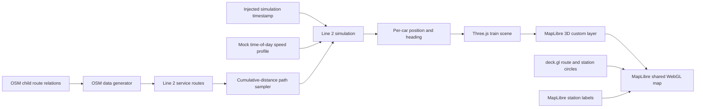

# feat: 2호선 Three.js 열차 시뮬레이션 추가

## Overview

서울 지하철 2호선 본선의 내선순환·외선순환 경로 위에 Three.js로 만든 3량 저폴리 열차 두 대를 배치하고, 시간 기반 시뮬레이션으로 서로 반대 방향으로 이동시킨다.

선택한 시각 목표는 대화에서 확정한 첫 번째 모듈형 열차 시안이다. 열차는 어두운 graphite 차체, 2호선 색상 띠, 연속 창문, 지붕 장치, 전조등·후미등을 가진다. Blender/GLB 없이 Three.js geometry와 material만으로 제작한다.

이 계획은 실제 서울교통공사 운행 데이터 연동이 아니라 `VISION.md`의 mock 열차 이동 단계에 해당한다. 시간대별 속도와 역 정차 시간은 명시적으로 demo 데이터로 관리한다.

구현은 완료했다. 체크되지 않은 항목은 현재 vertical slice 이후의 장시간·다중 카메라 시각 QA와 service-day 경계 연속성 후속 검증이다.

## 결정 사항

- MVP 범위는 2호선 본선 `외선순환`과 `내선순환`이다.
- 성수지선·신정지선은 데이터에 보존하되 렌더링과 시뮬레이션에서는 제외한다.
- 열차 모델은 실제 10량 편성을 재현하지 않고 지도용 3량 visual proxy로 만든다.
- 열차 전체를 하나의 rigid object로 이동하지 않는다. 각 차량이 경로상의 서로 다른 누적 거리를 샘플링해 곡선에서 자연스럽게 꺾이도록 한다.
- 프레임별 위치 누적이 아니라 주입된 simulation timestamp로 위치를 재계산한다. 탭 복귀, 프레임 드롭, 배속 변경에도 동일 시각은 동일 위치를 반환해야 한다.
- Three.js는 별도 canvas를 덮지 않고 MapLibre `CustomLayerInterface`의 공유 WebGL context에 `renderingMode: "3d"`로 연결한다.
- 표시 순서는 `deck.gl 노선 < Three.js 열차 < MapLibre 역명 라벨`을 목표로 한다.
- 초기 렌더링은 inspection zoom(`14.5` 초과)에서만 활성화한다.
- simulation day와 시간대 판정은 브라우저 locale이 아니라 `Asia/Seoul`을 기준으로 한다.
- train visibility는 route visibility와 독립된 toggle로 두되, 초기값은 ON으로 한다.
- 그림자, bloom/post-processing, 문 개폐 애니메이션은 MVP에서 제외한다.

## 현재 상태와 선행 조건

### 지도 렌더링

- MapLibre가 지도, 건물, 카메라, 역명 라벨을 담당한다.
- deck.gl `MapboxOverlay({ interleaved: true })`가 노선과 역사 원을 역명 라벨 앞에 렌더링한다.
- 현재 `package.json`에는 Three.js가 없다.
- 2026-07-10 npm 메타데이터 기준 `three@0.185.1`은 자체 TypeScript 선언을 제공하지 않으므로 `@types/three@0.185.1`을 함께 사용한다.

### 2호선 OSM 데이터

현재 생성기는 route master의 하위 relation을 모두 합치고 way 연결성만으로 `pathSegments`를 만든다. 이 과정에서 각 relation의 이름, `from/to`, 정방향과 운행 방향의 연결이 사라진다.

2호선 JSON에는 8개 relation과 7개 path segment가 있지만, 어떤 segment가 내선·외선인지 직접 식별할 수 없다.

| OSM relation | 의미 | MVP |
|---|---|---|
| `2404374` | 서울 지하철 2호선 외선순환 | 포함 |
| `4729409` | 서울 지하철 2호선 내선순환 | 포함 |
| `4729405`, `4729406` | 성수지선 양방향 | 제외 |
| `4729408`, `4729407` | 신정지선 양방향 | 제외 |
| `10722439`, `16421903` | 지선 railway/infrastructure route | 제외 |

따라서 Three.js 레이어보다 먼저 relation별 운행 경로를 보존하는 데이터 변경이 필요하다.

## 범위

### 포함

- relation별 경로·방향·정차 순서가 보존된 2호선 service route 데이터
- 외선순환과 내선순환을 위한 폐곡선 path sampler
- simulation timestamp 기반 이동 거리·속도·정차 상태 계산
- 각 차량의 위치·방향을 독립적으로 계산하는 3량 articulation
- Three.js procedural 저폴리 열차 모델
- MapLibre 공유 WebGL custom layer 통합
- 2호선 선택 상태, zoom, 열차 레이어 표시 상태 연동
- reduced-motion, 탭 복귀, style reload, WebGL resource cleanup 처리
- 순수 계산 로직의 단위 테스트와 브라우저 시각 검증

### 제외

- 실시간 도착 정보나 실제 시간표 API
- 실제 서울교통공사 속도·정차 정책이라고 주장할 수 있는 데이터
- 성수지선·신정지선 운행
- 실제 10량 편성 길이
- Blender, GLB, 텍스처 atlas, UV mapping
- 문 개폐, 팬터그래프, 승객, 충돌 감지
- replay UI, timeline UI, 열차 상세 패널
- 노선 전체가 보이는 저배율용 3D 모델
- 모바일 전용 레이아웃과 touch interaction 최적화

## Architecture



## Proposed data contracts

```ts
type SubwayServiceDirection =
  | "outer-loop"
  | "inner-loop"
  | "outbound"
  | "inbound"
  | "unknown";

interface SeoulSubwayOsmServiceRoute {
  id: string;
  lineNumber: SubwayLineNumber;
  osmRelationId: number;
  name: string;
  from?: string;
  to?: string;
  direction: SubwayServiceDirection;
  path: SubwayCoordinate[];
  stops: SeoulSubwayOsmServiceStop[];
}

interface SubwayTrainSimulationState {
  id: string;
  serviceRouteId: string;
  frontDistanceMeters: number;
  speedMetersPerSecond: number;
  phase: "moving" | "dwelling";
}

interface SubwayTrainCarPose {
  carIndex: number;
  coordinate: SubwayCoordinate;
  headingRadians: number;
}
```

차량별 거리는 다음 원칙으로 계산한다.

```txt
frontDistance = distanceAt(simulationTimestamp)
carDistance = wrap(frontDistance - carIndex * (carLength + carGap))
carPose = serviceRoute.sample(carDistance)
```

`distanceAt()`은 프레임 delta를 누적하지 않고, 하루 시작점부터 시간대별 speed profile과 station dwell 구간을 적용해 결정론적으로 계산한다.

## Implementation phases

### Phase 1: 2호선 운행 경로 데이터 보존

대상 파일:

- `scripts/generate-osm-subway-network.mjs`
- `src/features/subway/osm-subway-network.ts`
- `src/features/subway/data/osm-subway-line-2.json`
- `docs/osm-subway-network.md`

작업:

- [x] child route relation별 `id`, `name`, `from`, `to`, `route` tag를 보존한다.
- [x] 생성기에 `--line 2` filter를 추가해 이번 작업에서 다른 호선 JSON을 불필요하게 재생성하지 않는다.
- [x] relation member 순서와 way 방향을 존중해 directed path를 생성한다. 현재의 연결성 기반 `createConnectedPathSegments()` 결과를 운행 방향으로 간주하지 않는다.
- [x] stop/platform member 순서로 relation별 정차 순서를 보존한다.
- [x] 각 stop 좌표를 directed path의 가장 가까운 지점에 투영해 cumulative distance와 연결한다.
- [x] loop의 첫 정차역을 지나는 지점에서 stop distance가 단조 증가하도록 wrap 기준점을 정한다.
- [x] relation 이름과 ID를 기준으로 `outer-loop`, `inner-loop`, branch 방향을 명시적으로 분류한다.
- [x] 기존 통합 `route.pathSegments`는 노선 표시 호환성을 위해 유지한다.
- [x] line 2에 `serviceRoutes`를 추가하고 외선·내선 경로가 각각 닫힌 loop인지 검증한다.
- [x] `SeoulSubwayOsmLineNetwork.serviceRoutes`는 line 2 vertical slice 동안 optional로 두고, 다른 호선 확장 시 동일 생성기를 통해 채운다.
- [x] 생성 JSON은 직접 편집하지 않고 `--line 2` 실행 결과만 저장한다.
- [x] 성수·신정 지선 relation은 데이터에 남기되 MVP 선택 함수에서 제외한다.
- [x] OSM 갱신 시 relation 구조 변경을 감지할 수 있도록 예상 relation ID와 방향 검증을 추가한다.

완료 조건:

- 외선 `2404374`와 내선 `4729409`가 별도 directed path로 조회된다.
- 각 path는 끊김 없이 한 바퀴를 순환하고 시작·끝 좌표 간 gap이 허용 오차 안에 있다.
- 기존 deck.gl 노선 및 역사 렌더링 결과가 달라지지 않는다.

### Phase 2: 경로 sampler와 시간 기반 simulation

새 파일:

- `src/features/subway/subway-route-sampler.ts`
- `src/features/subway/line-2-train-simulation.ts`
- `src/features/subway/line-2-train-simulation.test.ts`

수정 파일:

- `package.json`
- `pnpm-lock.yaml`

작업:

- [x] 위·경도 path의 segment별 meter 거리와 cumulative distance를 한 번만 계산한다.
- [x] 임의 거리에서 좌표와 local tangent/heading을 반환하는 closed-loop sampler를 만든다.
- [x] timestamp를 주입받는 simulation clock contract를 만든다.
- [x] simulation timestamp를 `Asia/Seoul`의 service day와 minute-of-day로 변환한다.
- [x] 외선·내선에 서로 다른 phase offset을 가진 demo train 한 대씩 생성한다.
- [x] 시간대별 mock speed profile과 station dwell을 데이터로 분리한다.
- [x] 정차역 사이 이동 interval과 역 dwell interval로 하루 timeline을 구성한다.
- [x] 정확한 숫자가 실제 운행 정보가 아닌 demo parameter임을 문서화한다.
- [x] 3량 각각을 선두 거리에서 뒤쪽 offset만큼 샘플링한다.
- [x] loop 경계에서 선두·후미 차량이 끊기지 않도록 modulo 처리를 검증한다.

테스트:

- [x] 같은 timestamp는 항상 같은 거리·속도·pose를 반환한다.
- [x] frame 간격이 달라도 동일 timestamp 결과는 같다.
- [x] 외선·내선 tangent 방향이 서로 반대다.
- [x] 세 차량이 직선에서는 정렬되고 곡선에서는 각기 다른 heading을 가진다.
- [x] dwell 구간에서는 위치가 고정되고 속도가 `0`이다.
- [ ] 하루 경계와 loop 경계를 지나도 좌표가 튀지 않는다.
- [x] 다른 시스템 timezone에서도 동일 epoch timestamp는 같은 KST profile과 pose를 선택한다.
- [x] 비어 있거나 끊어진 path는 앱을 crash시키지 않고 train을 생략한다.
- [x] `package.json`에 `test: "vitest run"` script를 추가한다.

### Phase 3: Three.js procedural 열차 모델

새 파일:

- `src/features/subway/subway-train-model.ts`
- `src/features/subway/subway-train-materials.ts`

의존성:

- `three@0.185.1`
- `@types/three@0.185.1`
- `vitest@4.1.10`

작업:

- [x] `createSubwayTrainModel({ lineColor, carCount: 3 })` factory를 만든다.
- [x] 각 차량은 `Group`으로 분리하고 geometry/material은 인스턴스 사이에서 공유한다.
- [x] 차체는 `BoxGeometry`와 낮은 segment의 bevel/extrude 형태로 구성한다.
- [x] 운전실, 창문 band, 출입문, 2호선 띠, 지붕 HVAC, 단순 대차를 별도 mesh로 조립한다.
- [x] 진행 방향 앞에는 white emissive headlight, 뒤에는 red emissive tail light를 둔다.
- [x] per-train `PointLight`와 shadow map은 사용하지 않는다. emissive mesh와 공용 ambient/directional light로 표현한다.
- [x] material의 line color를 parameter로 분리해 다른 호선으로 재사용 가능하게 한다.
- [x] geometry, material, texture가 추가될 경우 모두 명시적으로 dispose하는 API를 제공한다.

완료 조건:

- 선택한 첫 번째 시안의 silhouette와 명암을 inspection zoom에서 식별할 수 있다.
- 외부 GLB/texture 없이 모델이 생성된다.
- 차량별 transform을 따로 적용해 곡선 articulation이 가능하다.

### Phase 4: MapLibre 3D custom layer 통합

새 파일:

- `src/features/subway/subway-train-custom-layer.ts`
- `src/components/subway-train-layer.tsx`

수정 파일:

- `src/components/seoul-subway-map.tsx`
- `src/features/subway/subway-layer-ids.ts`
- `src/features/subway/subway-layer-visibility.ts`
- `src/components/subway-layer-visibility-editor.tsx`

작업:

- [x] `CustomLayerInterface` 구현에 `type: "custom"`, `renderingMode: "3d"`를 사용한다.
- [x] MapLibre가 제공한 canvas와 WebGL context로 `THREE.WebGLRenderer`를 초기화하고 `autoClear = false`를 사용한다.
- [x] render 전후 Three renderer state를 reset해 MapLibre와 deck.gl 상태 오염을 막는다.
- [x] `MercatorCoordinate.fromLngLat()`와 `meterInMercatorCoordinateUnits()`로 meter 단위 모델을 지도 좌표에 배치한다.
- [x] rail과의 z-fighting을 피하는 작은 display altitude를 상수로 분리한다. 이 값은 실제 지하 깊이가 아닌 operational overlay offset이다.
- [x] 매 frame simulation timestamp에서 차량 pose를 갱신하고 활성 상태에서만 `map.triggerRepaint()`를 호출한다.
- [x] `onRemove`에서 renderer, geometry, material, event listener를 정리한다.
- [x] 2호선 선택 + train layer ON + inspection zoom일 때만 animation을 활성화한다.
- [x] `prefers-reduced-motion`에서는 열차를 고정 pose로 표시하고 continuous repaint를 중지한다.
- [x] map style reload 후 custom layer가 중복 없이 재부착되도록 한다.
- [x] React StrictMode의 mount/unmount 반복에도 동일 layer ID가 중복 등록되지 않도록 guard한다.
- [x] `webglcontextlost`에서는 animation을 중지하고 기본 지도를 유지하며, restore 후 resource를 한 번만 재생성한다.
- [x] Three 초기화가 실패하면 열차만 비활성화하고 기존 MapLibre/deck.gl 지도는 계속 사용할 수 있어야 한다.
- [x] route path 위, station label 아래의 순서를 고정한다.
- [x] 건물 depth에 가려지지 않는 operational x-ray 표현을 우선하되, 열차 내부의 차량 간 depth는 유지하는 전략을 브라우저에서 비교 검증한다.

### Phase 5: 시각·성능 검증과 문서화

검증 화면:

- 2호선 시청·을지로입구 인근 inspection zoom
- 2호선 성수 인근 곡선 구간
- 직선 구간
- 급곡선 구간
- loop 시작·종료가 만나는 구간
- 2호선과 다른 노선이 교차하는 구간

작업:

- [x] 상행·하행 두 열차가 각자의 선로 중심을 따라 반대 방향으로 움직이는지 확인한다.
- [x] headlight/tail light가 진행 방향과 일치하는지 확인한다.
- [x] 열차가 역명 라벨을 가리지 않고 route glow보다 위에 보이는지 확인한다.
- [ ] pitch/bearing/zoom 변경 후에도 좌표, scale, heading이 유지되는지 확인한다.
- [x] 탭을 백그라운드에 두었다가 복귀했을 때 누적 오차 없이 현재 timestamp 위치로 복구되는지 확인한다.
- [x] Three renderer 정보로 train layer draw call과 resource count를 기록하고 unmount 전후 누수가 없는지 확인한다.
- [x] `pnpm lint`, `pnpm build`, `pnpm test`를 실행한다.
- [x] `VISION.md`에 2호선 Three.js vertical slice와 mock speed policy를 반영한다.
- [x] `README.md`에 열차 레이어 실행 및 범위를 간단히 기록한다.

## User and system flows

1. 앱이 로드되고 station label layer가 준비되면 deck.gl과 Three.js layer가 순서대로 부착된다.
2. 2호선이 선택되어 있고 inspection zoom이면 외선·내선 열차가 현재 simulation timestamp 위치에서 나타난다.
3. 각 render frame은 timestamp에서 선두 거리를 다시 계산하고 세 차량의 pose를 개별 업데이트한다.
4. 2호선 선택을 해제하거나 train layer를 끄거나 zoom out하면 열차를 숨기고 repaint loop를 멈춘다.
5. 다시 활성화하면 누적된 delta가 아니라 현재 timestamp로 즉시 올바른 위치를 복원한다.
6. style reload 또는 component unmount 시 custom layer와 GPU resource를 제거하고, 재활성화 시 한 번만 생성한다.
7. WebGL context 손실이나 Three 초기화 실패 시 train layer만 중지되고 노선·역·라벨은 계속 보인다.

## Acceptance criteria

### Functional

- [x] 외선순환과 내선순환 경로가 OSM relation ID로 명확히 분리된다.
- [x] 두 열차가 각 방향의 물리적 선로를 따라 서로 반대 방향으로 이동한다.
- [x] 각 열차는 Three.js procedural geometry로 만든 3량 모델이다.
- [x] 세 차량은 곡선에서 같은 rigid heading을 공유하지 않고 각 위치의 tangent를 따른다.
- [x] 시간대별 mock speed와 station dwell이 timestamp 기반으로 적용된다.
- [x] 시간대와 service day는 `Asia/Seoul` 기준으로 판정된다.
- [x] 같은 timestamp 입력은 새로고침이나 frame rate와 관계없이 같은 pose를 만든다.
- [x] 2호선 선택, zoom, train layer visibility에 맞춰 표시와 animation이 시작·중지된다.

### Visual

- [x] 첫 번째 디자인 시안의 graphite 차체, 2호선 띠, 창문, 지붕 장치, 앞·뒤 조명이 식별된다.
- [x] train은 노선보다 위, 역명 label보다 아래에 보인다.
- [x] building과의 depth 정책이 operational overlay로 일관되고 차량 자체의 입체감은 유지된다.
- [ ] 급곡선, 교차 구간, 카메라 rotation에서도 선로 이탈이나 갑작스러운 회전이 없다.

### Quality gates

- [x] 순수 path/simulation 계산에 단위 테스트가 있다.
- [x] `pnpm lint` 통과
- [x] `pnpm build` 통과
- [x] `pnpm test` 통과
- [x] train layer 비활성·unmount 후 GPU resource와 event listener가 남지 않는다.
- [x] 기존 1~8호선 노선, 역사 circle, label 표시가 회귀하지 않는다.

## SpecFlow gaps and defaults

| 항목 | 기본 결정 | 향후 확장 |
|---|---|---|
| 실제 운행 데이터 | mock speed/dwell 사용 | 도착 정보·시간표 adapter |
| 2호선 지선 | MVP 제외 | relation별 train pool 추가 |
| 편성 길이 | 지도용 3량 proxy | zoom별 LOD 또는 실제 편성 |
| 탭 비활성화 | timestamp 기반으로 복귀 시 jump-to-current | replay continuity 정책 |
| reduced motion | 고정 pose, continuous repaint 중지 | 사용자 설정 |
| path 오류 | 해당 train만 숨기고 앱 유지 | 진단 UI/telemetry |
| 건물 가림 | x-ray operational overlay | 실제 지하 depth mode |
| 시간대별 수치 | demo 상수로 명시 | 검증된 운영 데이터 |
| WebGL 미지원·context loss | train layer만 중지, 지도 유지 | 사용자 진단 메시지 |
| route layer OFF | train toggle과 독립 유지 | layer preset 정책 |

## Risks and mitigations

- **OSM relation 구조 변경**: relation ID·name·route tag assertion을 생성기에 두고 실패 시 조용히 잘못된 JSON을 만들지 않는다.
- **relation member 방향 손실**: 현재 연결성 기반 path builder를 simulation에 재사용하지 않고 relation 순서를 보존하는 별도 directed builder를 둔다.
- **MapLibre/deck.gl/Three GL 상태 충돌**: renderer state reset, `autoClear = false`, layer lifecycle cleanup을 통합 spike에서 먼저 검증한다.
- **station과 track 좌표 불일치**: stop을 directed path에 투영하고 허용 거리 밖 stop은 생성 단계에서 실패시킨다.
- **React StrictMode와 style reload 중복 등록**: layer ID 존재 여부와 owner lifecycle을 한 곳에서 관리한다.
- **WebGL context loss**: train layer를 graceful fallback으로 격리하고 복구 시 resource를 재생성한다.
- **긴 열차의 곡선 이탈**: train group 하나를 회전하지 않고 차량별 distance/tangent를 계산한다.
- **프레임 누적 오차**: timestamp에서 pose를 재계산하고 delta accumulation을 금지한다.
- **과도한 GPU 비용**: geometry/material 공유, no shadows, no post-processing, inspection zoom gating을 적용한다.
- **실제 운행으로 오해**: 모든 speed/dwell 값에 mock 표기를 유지한다.

## Dependencies and resources

- 개발: React/TypeScript, MapLibre custom layer, Three.js/WebGL 이해
- 디자인: 선택된 첫 번째 모듈형 열차 시안
- 데이터: OpenStreetMap relation `7625892`과 하위 service route relations
- 신규 패키지: `three@0.185.1`, `@types/three@0.185.1`, `vitest@4.1.10`

## References

### Internal

- `VISION.md:7-24` — 실시간 3D 운영 콘솔 및 Three.js 역할
- `VISION.md:39-54` — mock 열차 이동과 고급 3D 단계
- `src/components/seoul-subway-map.tsx:55-108` — MapLibre/deck.gl 결합과 label 준비 시점
- `src/features/subway/subway-paths.ts:78-139` — zoom visual level과 현재 deck layer 구성
- `src/features/subway/subway-paths.ts:356-374` — 통합 path segment의 현재 소비 방식
- `scripts/generate-osm-subway-network.mjs:128-167` — child relations를 합치는 현재 생성 과정
- `scripts/generate-osm-subway-network.mjs:268-344` — 연결성 기반 path 생성과 방향 손실 지점
- `src/features/subway/osm-subway-network.ts:21-49` — 현재 OSM route 타입
- `src/features/subway/subway-layer-visibility.ts:1-34` — train visibility 확장 지점

### External

- [MapLibre: Add a 3D model using Three.js](https://maplibre.org/maplibre-gl-js/docs/examples/add-a-3d-model-using-threejs/)
- [MapLibre: CustomLayerInterface](https://maplibre.org/maplibre-gl-js/docs/API/interfaces/CustomLayerInterface/)
- [Three.js: ExtrudeGeometry](https://threejs.org/docs/pages/ExtrudeGeometry.html)
- [Three.js: Curve](https://threejs.org/docs/pages/Curve.html)
- [OSM relation 2404374 — 2호선 외선순환](https://www.openstreetmap.org/relation/2404374)
- [OSM relation 4729409 — 2호선 내선순환](https://www.openstreetmap.org/relation/4729409)
