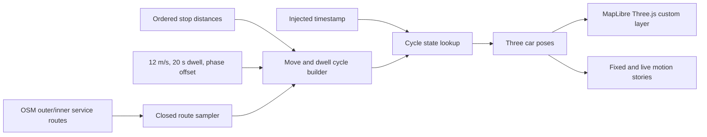

# refactor: 2호선 일정 속도·시간 기반 정차 시뮬레이션 재구성

## Overview

현재 2호선 외선순환·내선순환에는 Three.js procedural 3량 열차와 timestamp 기반 이동 로직이 이미 연결되어 있다. 다만 이동 속도가 한국 시간대별 mock profile에 따라 달라지고, 하루 전체 timeline을 미리 생성하는 구조라 이번 요구인 **역 사이 일정 속도 이동과 시간 기반 정차**보다 동작 규칙이 복잡하다.

이번 작업은 기존 열차 모델, OSM service route, MapLibre custom layer를 유지하면서 시뮬레이션만 다음 규칙으로 재구성한다.

- 열차는 역 사이를 하나의 고정 순항 속도로 이동한다.
- 역에 도착하면 정해진 시간 동안 같은 위치에 머문다.
- 현재 위치는 frame delta 누적이 아니라 주입된 timestamp에서 직접 계산한다.
- 외선순환과 내선순환에 한 대씩 배치하며 각 열차는 서로 다른 phase offset을 사용한다.
- 값은 시각 검증용 mock parameter이며 실제 서울교통공사 운행 정보로 표현하지 않는다.

이 계획은 기존 `2026-07-10-feat-line-2-threejs-train-simulation-plan.md`의 모델과 지도 통합 결과를 재사용하고, 그중 **Phase 2 이동 규칙만 대체하는 후속 계획**이다.

## Problem statement

현재 구현에는 다음 차이가 있다.

- `SubwayTrainSimulationOptions`가 단일 속도가 아니라 `speedProfile`을 받는다.
- `createDailyTimeline()`이 24시간 전체를 여러 속도 구간으로 분할한다.
- 한국 시간 자정마다 하루 timeline이 다시 시작되므로 route cycle 길이와 하루 길이가 맞지 않으면 경계에서 위치가 바뀔 수 있다.
- Storybook에서는 실제 2호선 경로를 볼 수 있지만, 현재 열차가 이동 중인지 정차 중인지 명시적으로 확인하기 어렵다.

이번 요구에서는 실제 시간표나 혼잡 시간대 속도 변화보다 “움직임과 정차가 예측 가능하게 보이는가”가 더 중요하다. 따라서 route 한 바퀴의 운행 주기를 기준으로 단순하고 결정론적인 simulation을 만든다.

## Decisions

- 기본 순항 속도는 `12 m/s`로 둔다. 약 `43.2 km/h`이지만 실제 운행 수치가 아닌 demo 값이다.
- 모든 역의 기본 정차 시간은 `20초`로 둔다.
- 가속·감속은 이번 범위에서 구현하지 않는다. 출발 시 `0 → 12 m/s`, 도착 시 `12 → 0 m/s`로 상태가 전환된다.
- 하루 단위 speed profile과 `Asia/Seoul` minute-of-day 계산을 제거한다.
- route 한 바퀴의 cycle duration을 계산하고, 절대 timestamp를 고정된 simulation epoch와 cycle duration에 매핑한다.
- 동일 timestamp는 브라우저 timezone, frame rate, 탭 비활성 시간과 관계없이 동일 상태를 반환한다.
- 외선·내선의 directed service route와 stop distance는 현재 OSM 생성 결과를 그대로 사용한다.
- 열차 형상은 기존 Three.js 3량 모델을 재사용한다. Blender, GLB, 외부 texture는 추가하지 않는다.
- 2호선 지선, 실제 운행 시간표, 열차 다중 배차는 제외한다.

## Scope

### Included

- 단일 순항 속도 기반 route cycle 생성
- 역별 고정 dwell segment 생성
- timestamp 기반 이동·정차 상태 계산
- 외선·내선 열차의 독립 phase offset
- loop seam을 통과하는 차량별 좌표와 heading 유지
- 기존 MapLibre custom layer 연결 갱신
- Storybook에서 이동·정차 상태를 재현하는 고정 timestamp 시나리오
- 단위 테스트, 지도 시각 QA, 문서 갱신

### Excluded

- 실제 도착 정보·시간표·GPS 연동
- 첫차·막차 및 운행 종료 시간
- 역별 서로 다른 정차 시간
- 급행·회차·운휴·지연 이벤트
- 물리 기반 가속·감속 curve
- 열차 추가 배차 및 간격 제어
- procedural 열차 외형 재설계
- 2호선 성수·신정 지선 열차

## Target architecture



### Proposed simulation contract

```ts
interface SubwayTrainSimulationOptions {
  id: string;
  sampler: SubwayRouteSampler;
  stopDistancesMeters: number[];
  carCount: number;
  carSpacingMeters: number;
  cruiseSpeedMetersPerSecond: number;
  dwellSeconds: number;
  phaseOffsetSeconds: number;
  simulationEpochMs: number;
}

interface SubwayTrainSimulationState {
  id: string;
  phase: "moving" | "dwelling";
  frontDistanceMeters: number;
  speedMetersPerSecond: number;
  carPoses: SubwayTrainCarPose[];
}
```

### Cycle calculation

정규화된 각 stop에 대해 다음 두 segment를 순서대로 만든다.

```txt
dwellDuration = dwellSeconds
moveDistance = forwardDistance(currentStop, nextStop, routeLength)
moveDuration = moveDistance / cruiseSpeedMetersPerSecond

cycle = [dwell at stop 0, move 0 → 1, dwell at stop 1, move 1 → 2, ...]
cycleDuration = sum(all segment durations)
cycleSecond = wrap((timestampMs - simulationEpochMs) / 1000 + phaseOffsetSeconds, cycleDuration)
```

`cycleSecond`가 속한 segment를 찾은 뒤 이동 segment에서는 `elapsed * cruiseSpeed`로 거리를 계산하고, dwell segment에서는 역 위치를 그대로 반환한다.

## Implementation phases

### Phase 1: simulation timeline을 route cycle로 교체

대상 파일:

- `src/features/subway/line-2-train-simulation.ts`
- `src/features/subway/line-2-train-simulation.test.ts`

작업:

- [x] `speedProfile`을 `cruiseSpeedMetersPerSecond` 단일 값으로 교체한다.
- [x] `SECONDS_PER_DAY`, `KOREAN_TIME_FORMATTER`, `getKoreanMinuteOfDay()`를 제거한다.
- [x] `createDailyTimeline()`을 한 바퀴 단위 `createRouteCycle()`로 교체한다.
- [x] stop distance를 정렬·중복 제거하고 route seam을 포함한 전진 거리로 변환한다.
- [x] 각 역마다 dwell segment와 다음 역까지의 moving segment를 만든다.
- [x] timestamp를 simulation epoch 기준 cycle offset으로 변환한다.
- [x] moving 상태에서는 항상 설정된 순항 속도를 반환한다.
- [x] dwelling 상태에서는 역 좌표에 고정하고 속도 `0`을 반환한다.
- [x] 잘못된 속도, 음수 정차 시간, 유효하지 않은 route length는 명시적으로 실패시킨다.
- [x] 비어 있는 stop 목록은 route 시작점 하나를 임시 정차점으로 사용할지, simulation 생성을 거부할지 테스트에서 정책을 고정한다. 기본 결정은 생성을 거부하는 것이다.

테스트:

- [x] 동일 timestamp가 동일한 거리, phase, 차량 pose를 반환한다.
- [x] 서로 다른 frame interval로 조회해도 같은 timestamp 결과가 같다.
- [x] moving segment의 두 timestamp 사이 이동 거리가 `12 m/s × 경과 시간`과 일치한다.
- [x] dwell 시작부터 20초 동안 선두 위치가 변하지 않고 속도가 `0`이다.
- [x] dwell 종료 경계에서 다음 moving segment로 정확히 전환된다.
- [x] 마지막 역에서 첫 역으로 넘어가는 loop seam에서도 거리가 연속적이다.
- [x] cycle duration만큼 지난 timestamp가 같은 상태를 반환한다.
- [x] 큰 시간 점프와 자정 통과에도 중간 frame 누적 없이 올바른 상태를 반환한다.
- [x] 세 차량이 각자의 route distance와 tangent를 유지한다.
- [x] 잘못된 설정은 조용한 `NaN` 대신 명확한 오류를 반환한다.

### Phase 2: 지도 custom layer에 고정 운행 설정 적용

대상 파일:

- `src/features/subway/subway-train-custom-layer.ts`
- 필요 시 `src/components/subway-train-layer.tsx`

작업:

- [x] `MOCK_SPEED_PROFILE`을 `LINE_2_CRUISE_SPEED_METERS_PER_SECOND = 12`로 교체한다.
- [x] `LINE_2_DWELL_SECONDS = 20`과 고정 simulation epoch를 함께 정의한다.
- [x] 외선·내선에 서로 다른 phase offset을 적용하되, route index에 암묵적으로 의존하지 않도록 direction별 설정으로 표현한다.
- [x] 매 render frame에서 `Date.now()`를 simulation에 주입하는 현재 방식은 유지한다.
- [x] `prefers-reduced-motion`에서는 고정 timestamp와 continuous repaint 중지 정책을 유지한다.
- [x] custom layer 생성·제거, WebGL context loss, style reload lifecycle은 변경하지 않는다.
- [x] 기존 procedural 3량 모델과 차량별 pose 적용을 그대로 재사용한다.

완료 조건:

- 외선·내선 열차가 각 directed track을 따라 일정 속도로 이동한다.
- 역에 도착한 열차는 정확히 20초 동안 같은 track 위치에 머문다.
- 2호선 선택 해제, zoom out, train layer OFF 상태에서는 repaint loop가 중지된다.

### Phase 3: Storybook에서 이동과 정차를 분리 검증

대상 파일:

- `src/features/subway/model-lab/subway-train-preview.tsx`
- `src/features/subway/model-lab/subway-train-motion.stories.tsx`
- 필요 시 `src/features/subway/model-lab/subway-train-model-lab.css`

작업:

- [x] Model Lab의 2호선 simulation 호출부를 새 단일 속도 contract로 변경한다.
- [x] `Line2FixedTimestamp`가 moving 상태를 재현하는 고정 timestamp를 사용하도록 한다.
- [x] 정차 시작 중간 시각을 고정한 `Line2Dwelling` story를 추가한다.
- [x] story 표면에 외선·내선의 `phase`와 현재 속도를 표시해 정차 여부를 눈으로 확인할 수 있게 한다.
- [x] `Line2Live`의 speed control은 simulation 순항 속도를 바꾸지 않고 재생 배속만 조절한다는 의미를 유지한다.
- [x] story 전환과 unmount 후 canvas, animation frame, Three.js resource가 중복되지 않는지 확인한다.

### Phase 4: 지도 시각 QA와 문서 갱신

대상 파일:

- `README.md`
- `VISION.md`
- `docs/plans/2026-07-10-feat-line-2-threejs-train-simulation-plan.md`

작업:

- [x] 기존 문서의 “시간대별 속도 profile” 설명을 “일정 순항 속도와 역 정차”로 갱신한다.
- [x] 기존 구현 계획에는 motion phase가 이 후속 계획으로 대체되었음을 기록한다.
- [x] 시청·을지로입구 부근에서 역 정차 위치와 라벨 정렬을 확인한다.
- [x] 성수 곡선과 loop seam에서 세 차량의 heading과 간격을 확인한다.
- [x] 외선·내선이 서로 반대 directed route를 따르는지 확인한다.
- [x] 브라우저 탭을 비활성화했다가 복귀했을 때 현재 timestamp 상태로 즉시 복원되는지 확인한다.
- [x] pitch, bearing, zoom 변경 후에도 열차가 track에서 이탈하지 않는지 확인한다.

## User and system flow

1. 사용자가 2호선을 선택하고 inspection zoom으로 진입한다.
2. train layer가 외선·내선 service route에서 sampler와 route cycle을 각각 한 번 생성한다.
3. render frame마다 현재 timestamp가 각 cycle의 local second로 변환된다.
4. moving segment면 열차가 `12 m/s`로 이동하고, dwell segment면 역 위치에서 `20초` 정지한다.
5. 선두 거리에서 차량 간격을 빼 각 차량의 좌표와 heading을 독립 계산한다.
6. 탭 복귀나 frame drop이 발생해도 누적 delta를 따라잡지 않고 현재 timestamp 상태를 즉시 렌더링한다.
7. layer를 끄거나 zoom out하면 custom layer가 제거되고 repaint가 중지된다.

## Acceptance criteria

### Functional

- [x] 외선순환과 내선순환에 Three.js 3량 열차 한 대씩 표시된다.
- [x] 두 열차는 각자 directed 2호선 track을 따라 반대 방향으로 움직인다.
- [x] 이동 중 보고되는 속도는 모든 시간대와 역간 구간에서 `12 m/s`로 일정하다.
- [x] 각 역 도착 시 열차가 정확히 `20초` 정차한다.
- [x] 정차 중 선두와 세 차량의 위치가 변하지 않는다.
- [x] 같은 timestamp는 frame rate와 runtime timezone에 관계없이 같은 pose를 반환한다.
- [x] 자정, route seam, 장시간 탭 비활성 이후에도 갑작스러운 역주행이나 누적 오차가 없다.
- [x] 2호선 visibility와 inspection zoom 조건이 기존처럼 유지된다.

### Visual

- [x] 열차가 역 정차 시 track 위 station anchor와 시각적으로 정렬된다.
- [x] 직선과 곡선에서 세 차량의 간격과 tangent가 유지된다.
- [x] headlight와 tail light가 진행 방향과 일치한다.
- [x] pitch, bearing, zoom 변경 후에도 열차 scale과 위치가 안정적이다.
- [x] Storybook에서 moving과 dwelling 상태를 각각 고정 시각으로 비교할 수 있다.

### Quality gates

- [x] `pnpm lint`
- [x] `pnpm test`
- [x] `pnpm test:coverage`
- [x] `pnpm build`
- [x] `pnpm build:storybook`
- [x] `git diff --check`
- [x] 기존 노선·역사·라벨과 열차 visibility 동작이 회귀하지 않는다.
- [x] custom layer 제거 후 animation frame, event listener, GPU resource가 남지 않는다.

## SpecFlow gaps and defaults

| 항목 | 이번 기본 결정 | 향후 확장 |
|---|---|---|
| 순항 속도 | 전 구간 `12 m/s` | 역간·혼잡도별 profile |
| 정차 시간 | 모든 역 `20초` | 역별 dwell 및 지연 |
| 시간 기준 | 고정 epoch부터 반복되는 route cycle | 실제 service day와 timetable |
| 자정 경계 | cycle이 끊기지 않고 계속 진행 | 첫차·막차 정책 |
| 가속·감속 | 즉시 속도 전환 | easing 또는 물리 기반 profile |
| 열차 수 | 외선·내선 각 1대 | headway 기반 train pool |
| phase offset | direction별 demo 상수 | 배차표 기반 출발 시각 |
| stop 누락 | simulation 생성 실패, 해당 train 생략 | 데이터 진단 UI |
| reduced motion | 고정 pose와 repaint 중지 | 사용자별 replay 설정 |
| 실제성 표기 | mock/demo로 명시 | 검증된 운영 데이터 adapter |

## Risks and mitigations

- **역 도착 경계 부동소수점 오차**: segment 시작·종료 시간을 누적하고 경계 비교 정책을 테스트로 고정한다.
- **route seam 순간이동처럼 보임**: wrapped distance와 실제 위·경도 path의 시작·끝 연결성을 함께 검증한다.
- **정차역과 track 불일치**: OSM 생성 단계에서 path에 투영된 `stop.distanceMeters`만 사용한다.
- **외선·내선 설정 뒤바뀜**: array index 대신 `serviceRoute.direction`을 key로 설정한다.
- **재생 배속과 운행 속도 혼동**: Storybook `speed` control은 clock 배속으로 이름과 설명을 분리한다.
- **실제 운행 데이터로 오해**: 속도와 정차 상수에 `MOCK` 또는 `DEMO` 의미를 유지하고 README에 명시한다.
- **불필요한 렌더링 비용**: 현재 inspection zoom gating, reduced motion, layer cleanup 정책을 유지한다.

## Internal references

- `src/features/subway/line-2-train-simulation.ts:37-174` — 현재 speed profile과 하루 timeline
- `src/features/subway/line-2-train-simulation.test.ts:26-95` — 결정론·정차·시간대별 속도 테스트
- `src/features/subway/subway-train-custom-layer.ts:26-124` — 현재 mock profile과 simulation 구성
- `src/features/subway/subway-train-custom-layer.ts:138-174` — timestamp 기반 차량 pose 반영
- `src/features/subway/subway-train-model.ts:26-55` — 재사용할 procedural 열차 factory
- `src/components/seoul-subway-map.tsx:77-84` — 열차 layer 활성 조건
- `src/features/subway/model-lab/subway-train-preview.tsx:332-478` — 실제 2호선 Storybook motion surface
- `docs/plans/2026-07-10-feat-line-2-threejs-train-simulation-plan.md:183-220` — 기존 motion phase

## Implementation approval boundary

이 문서 작성은 계획 단계다. 실제 TypeScript, Storybook, 문서 수정과 테스트 실행은 사용자가 이 계획을 승인한 뒤 진행한다.
